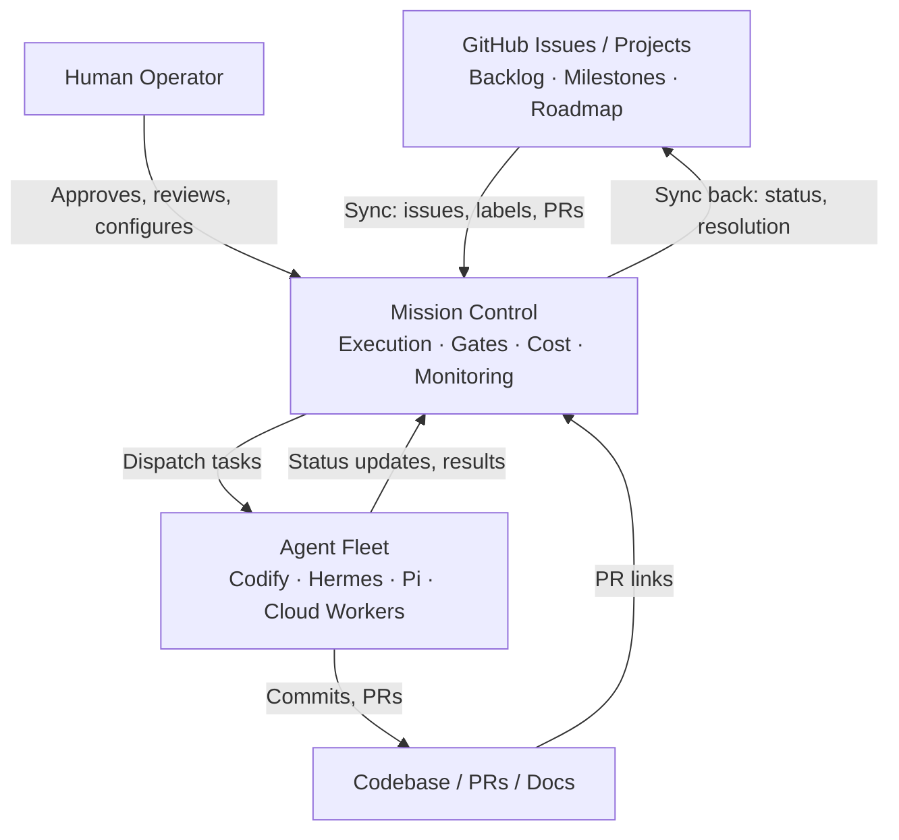
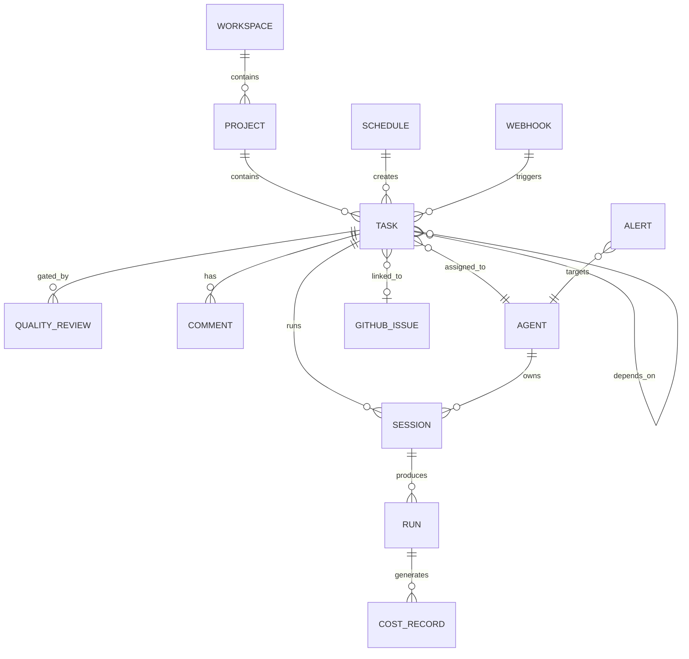
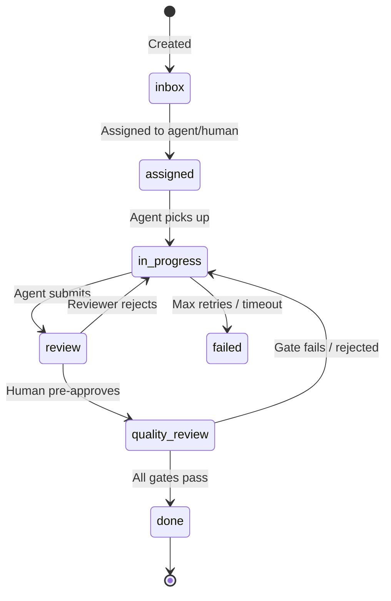

# Mission Control — Unified System Design

> **Status:** Living design document. Reflects current capability, recommended design, and phased roadmap.
> **Last updated:** 2026-05-28
> **Audience:** Humans and coding agents.

---

## 1. Executive Summary

Mission Control is an **agent-native execution platform** — not a Jira clone, not a chat interface, not an autonomous coding system without guardrails.

Its job is to be the central control plane that sits between humans making strategic decisions (in GitHub) and agents doing execution work (in code). It tracks what work is happening, who (or what) is doing it, whether it passed review, what it cost, and what happened.

GitHub owns the backlog and roadmap. Mission Control owns execution.

```
GitHub Issues/Projects  →  Mission Control  →  Code / PRs / Docs
  (what to build)           (who builds it,      (what got built)
                             how, reviewed,
                             at what cost)
```

---

## 2. Product Definition

**Mission Control is:**
- Agent operations control plane
- Lightweight project and task management layer
- Multi-agent task board with assignment and dispatch
- Review and quality gate system
- Execution visibility layer (sessions, runs, logs)
- Scheduler and recurring task manager
- Cost tracking and budget enforcement layer
- Integration bridge to GitHub Issues and Projects

**Mission Control is not:**
- A full Jira or Linear replacement
- An enterprise portfolio management platform
- A pure chat or conversational interface
- An uncontrolled autonomous execution system
- A code editor or IDE
- A CI/CD system

**Operating model:**

```
Discover → Plan → Review → Approve → Implement → Verify → Document → Improve
```

---

## 3. Unified Architecture



### Layer responsibilities

| Layer | Tool | Owns |
|-------|------|------|
| Strategy | GitHub Projects | Milestones, roadmap, sprint planning |
| Backlog | GitHub Issues | Feature requests, bugs, epics |
| Execution | Mission Control | Tasks, agents, sessions, reviews, cost |
| Memory | docs/roadmap.md + ADRs | Long-term architecture decisions |
| Output | Git / PRs | Code, docs, infra changes |

---

## 4. Core Entities

### Entity model



### Entity definitions

**Workspace** — top-level isolation boundary. All data is scoped to a workspace. A personal installation has one workspace; a team installation may have several.

**Project** — a named initiative with a ticket prefix (e.g. `MC-`, `DD-`). Maps to a GitHub repo or a GitHub Project. Contains tasks.

**Task** — the atomic unit of work. Has a lifecycle state, priority, assignee (human or agent), linked GitHub issue, linked sessions, and quality reviews. The equivalent of a GitHub Issue at the execution layer.

**Ticket** — a task's human-readable reference (`PROJECT-NNN`). Auto-incremented per project.

**Agent** — a named automated worker registered with MC. Has a role, capability set, heartbeat, and cost history. Can be a CLI agent (self-pickup), a webhook-triggered worker, or a sub-agent spawned by a parent session.

**Sub-agent** — an agent spawned within a session to handle a subtask. Reports back to its parent session. Useful for parallel workstreams within a single task.

**Session** — a single continuous execution context for an agent. Starts when an agent picks up a task, ends when it reports done, times out, or is cancelled. One task can have multiple sessions (retries).

**Run** — a discrete execution event within a session (a single tool invocation, a Codex turn, etc.). Carries token counts, latency, and model used.

**Review** — a structured evaluation of a task's output by a named reviewer (human or Aegis). Has a status: `approved`, `rejected`, `needs_revision`.

**Quality Gate** — a named checkpoint that must be satisfied before a task can advance. Can be automated (CI passes) or manual (human approval). Defined per project or per task type.

**Schedule** — a cron expression or interval that creates tasks automatically. Supports one-shot (due date) and recurring.

**Webhook** — an inbound trigger from an external system (GitHub, CI, Slack) that creates or updates tasks.

**Alert** — a notification fired when a condition is met: agent over cost cap, task stalled, gate failed, agent offline.

**Cost Record** — a token/USD record attached to a session or run. Aggregated per agent, per project, per week.

**Decision / ADR** — a record of a significant architecture or product decision. Stored in `docs/decisions/ADR-NNN-*.md`, referenced from tasks and projects.

**Document Reference** — a pointer from a task or project to a doc file, GitHub wiki page, or external URL. Not stored as content — MC stores the pointer, the doc lives in the repo.

---

## 5. Project Management Model

### Task lifecycle



### Task fields (current + recommended)

| Field | Current | Recommended |
|-------|---------|-------------|
| id, title, description | ✅ | — |
| status (7 states) | ✅ | — |
| priority (low/medium/high/urgent) | ✅ | — |
| assigned_to | ✅ | + support array (multi-agent) |
| tags | ✅ JSON array | — |
| due_date | ✅ | — |
| github_issue_number | ✅ | — |
| github_pr_number | ✅ | — |
| resolution, error_message | ✅ | — |
| **depends_on** | ❌ missing | Add: `task_dependencies` table |
| **parent_id** | Schema only | Add to DB, enforce in API |
| **blocked_by** | ❌ | Derived from depends_on |
| **estimated_tokens** | ❌ | Add for pre-dispatch budgeting |
| **gate_config** | ❌ | JSON: required gates per task |

### What stays in GitHub Issues, not MC

| Item | Lives in |
|------|----------|
| Feature requests from users | GitHub Issues |
| Bug reports | GitHub Issues |
| Epics and milestones | GitHub Projects |
| Sprint planning | GitHub Projects |
| PR code review | GitHub PR reviews |
| Release notes | GitHub Releases |
| Roadmap voting | GitHub Discussions |
| **Agent task execution** | Mission Control |
| **Agent session logs** | Mission Control |
| **Cost and token usage** | Mission Control |
| **Quality gate results** | Mission Control |
| **Scheduling and automation** | Mission Control |

---

## 6. GitHub Integration Model

### Sync architecture

```
GitHub Issue created
        ↓
MC webhook receives it
        ↓
MC creates linked Task (status: inbox)
        ↓
Agent executes, commits, opens PR
        ↓
MC updates Task (status: review, pr_number: N)
        ↓
PR merged
        ↓
MC marks Task done, syncs resolution back to GitHub Issue
        ↓
GitHub Issue closed
```

### Mapping table

| GitHub | Mission Control | Direction | Notes |
|--------|----------------|-----------|-------|
| Issue title | Task title | ↔ bidirectional | MC is source during execution |
| Issue body | Task description | → GitHub→MC on create | MC description may diverge |
| Issue labels | Task tags | ↔ configurable mapping | e.g. `bug` → tag `bug` |
| Issue assignee | Task assigned_to | → GitHub→MC suggestion | MC may re-assign to agent |
| Issue milestone | Project | → GitHub→MC | Milestone = Project in MC |
| Issue state (open/closed) | Task status | ↔ | closed ↔ done |
| PR number | github_pr_number | ← MC→GitHub | MC tracks PR opened by agent |
| PR review approved | Quality gate passed | ← | Triggers gate in MC |
| Issue comment | Task comment | ↔ | Optional, configurable |
| Issue closed | Task done | ↔ | Bidirectional close |

### Conflict handling

- **Source of truth:** GitHub is authoritative for issue existence, title, and strategic metadata. MC is authoritative for execution state (status, resolution, cost, sessions).
- **On conflict:** MC never overwrites a GitHub issue title without human approval. GitHub closing an issue does not auto-close a task if a gate is still open in MC.
- **Label drift:** Label mapping is configured per project. Unmapped labels are ignored, not deleted.
- **Re-open:** If a GitHub issue is re-opened, MC creates a new task linked to the same issue (does not resurrect the old done task).

---

## 7. Agent Operating Model

### Agent roles

| Role | Can do | Cannot do autonomously | Typical agent |
|------|--------|----------------------|---------------|
| **Research Agent** | Read files, search web, analyze repo, produce findings docs | Write code, modify repo | Hermes, Pi |
| **Repo Cartographer** | Read all files, map structure, produce architecture docs | Modify files | Pi, Codex |
| **Architect Agent** | Produce design docs, ADRs, plans | Implement, merge | Claude-code |
| **Security Reviewer** | Audit code, flag risks, produce security reports | Fix code directly | Codex, Claude-code |
| **Implementation Agent** | Write code, create PRs, run tests | Merge PRs, deploy, modify secrets | Codex, Claude-code |
| **QA / Verification Agent** | Run tests, verify acceptance criteria, produce test reports | Merge, deploy | Codex |
| **Documentation Agent** | Write and update docs, changelogs, ADRs | Modify code | Claude-code |
| **PM / Planning Agent** | Create tasks, update roadmap, write plans | Approve tasks, merge | Claude-code |
| **Review Agent (Aegis)** | Review task output, approve/reject quality gates | Implement code | Aegis (built-in) |

### When to use each execution mode

| Mode | When to use |
|------|-------------|
| **Single agent** | Isolated task, one file area, clear spec |
| **Sub-agent workstream** | Task has parallel independent subtasks (research + explore simultaneously) |
| **Agent team (COORD)** | Complex goal needing multiple specialties; coordinator creates child tasks |
| **Inline automode** | Fast, low-risk, reversible actions (read, analyze, draft) |
| **Human-in-loop** | Merges, deploys, secret changes, high-risk rewrites |

### Agent dispatch model (current)

```
Task created (inbox)
    ↓
assigned_to set
    ↓
Agent polls GET /api/tasks/queue?agent=<name>
    ↓
Agent picks up, sets status=in_progress
    ↓
Agent executes, posts resolution
    ↓
Agent sets status=review
    ↓
Aegis reviews → approved → done
              → rejected → back to in_progress
```

**Gap:** No push dispatch. Agents self-poll. Recommendation: add SSE/webhook push for faster pickup on time-sensitive tasks.

---

## 8. Permission and Approval Model

### Action classification

**Allowed without human approval:**
- Read files, search codebase, analyze repo
- Suggest roadmap changes, create draft plans
- Create draft docs (not committed)
- Run read-only tests
- Post task comments
- Create tasks in `inbox`
- Research and produce findings

**Requires human approval before execution:**
- Write code and commit to a branch
- Create or delete branches
- Install or remove dependencies
- Modify infrastructure config
- Change or rotate secrets
- Open pull requests
- Merge pull requests
- Trigger production deployments
- Send external notifications (Slack, email)
- Mark a task `done` (Aegis gate)

**Forbidden by default (policy-blocked):**
- Exfiltrate secrets or credentials
- Delete files not created in the current session without explicit listing
- Modify production systems without approval chain
- Bypass quality gates (`skip_gate` flag requires admin)
- Access other workspaces' data
- Self-approve own work (agent cannot be both implementer and Aegis reviewer)

### Permission levels

| Role | Inbox | Assign | Implement | Review | Approve | Admin |
|------|-------|--------|-----------|--------|---------|-------|
| Viewer | read | — | — | — | — | — |
| Operator | read | self | — | — | — | — |
| Agent | read | self | yes | — | — | — |
| Reviewer (Aegis) | read | — | — | yes | yes | — |
| Admin | full | full | full | full | full | full |

---

## 9. Quality Gate Model

### Gate types

| Type | Description | Blocks task? |
|------|-------------|-------------|
| **Required** | Must pass to advance | Yes |
| **Blocking** | Fails = task rejected back to in_progress | Yes |
| **Optional** | Advisory, does not block | No |
| **Advisory** | Recommendation attached to task | No |
| **Manual** | Human must click approve | Yes |
| **Automated** | CI result, test pass, lint pass | Yes |

### Default gate chain (recommended)

```
in_progress → review:
  [auto] syntax check (node --check, tsc --noEmit)
  [auto] no innerHTML / security hook
  [auto] tests pass

review → quality_review:
  [manual] human pre-review or Aegis pre-review

quality_review → done:
  [required] Aegis approval (reviewer='aegis', status='approved')
  [optional] security review for tasks tagged 'security'
  [optional] docs check for tasks tagged 'docs-required'
```

### Per-task gate override

Tasks can declare a `gate_config` JSON field:
```json
{
  "skip_tests": false,
  "require_security_review": true,
  "require_human_approval": true,
  "min_reviewers": 2
}
```

High-risk tasks (infra, secrets, production) should always require `require_human_approval: true`.

---

## 10. Documentation Architecture

```
docs/
  mission-control-design.md      ← this document
  roadmap.md                     ← phased roadmap, high-level
  architecture.md                ← system architecture, data model
  agent-operating-model.md       ← agent roles, dispatch, modes
  security-model.md              ← permissions, gates, threat model
  github-sync-model.md           ← sync rules, mapping table
  task-lifecycle.md              ← state machine, gate chain
  decisions/
    ADR-001-sqlite-over-postgres.md
    ADR-002-self-pickup-dispatch.md
    ADR-003-aegis-quality-gates.md
  tasks/
    phase-0-discovery.md
    phase-1-foundations.md
    phase-2-mvp.md
    phase-3-agent-execution.md
    phase-4-quality-hardening.md
    phase-5-scale.md
  evals/
    success-criteria.md
    test-plan.md
    review-checklist.md
```

### What lives where

| Content | Location |
|---------|----------|
| Strategic intent, "why we built this" | `docs/roadmap.md` |
| Architecture decisions with rationale | `docs/decisions/ADR-NNN.md` |
| System design (this doc) | `docs/mission-control-design.md` |
| Agent operating instructions | `docs/agent-operating-model.md` |
| Phase-level task breakdowns | `docs/tasks/phase-N.md` |
| Acceptance criteria, test plans | `docs/evals/` |
| Per-feature task specs | `docs/tasks/<feature>.md` |
| GitHub Issues | Strategic backlog, bugs, feature requests |
| Mission Control tasks | Execution tracking only |
| ADRs | Any decision with non-obvious tradeoffs or future impact |

**Rule:** If a doc explains *why*, it's an ADR. If it explains *what to build*, it's a task spec. If it explains *how it works now*, it's architecture. If it explains *what the agent should do*, it's the operating model.

---

## 11. Roadmap

### Phase 0 — Discovery ✅ (current state)
- Existing: SQLite DB, Next.js app, basic Kanban, agent heartbeat, cost tracking, Aegis gate
- Existing: GitHub issue/PR fields on tasks, label sync, quality_reviews table
- Gaps identified: no `depends_on`, `parent_id` not in DB, no weekly cost caps, no push dispatch, no project-level gate config, no ADR structure

### Phase 1 — Foundations
- `task_dependencies` table: `depends_on` and `blocked_by` relationships
- `parent_id` properly stored and enforced in DB + API
- Dispatch: blocked tasks not returned by `/api/tasks/queue`
- Documentation skeleton: create `docs/decisions/`, `docs/tasks/`, `docs/evals/`
- ADR-001 through ADR-003 written for existing key decisions

### Phase 2 — Project Management Hardening
- Per-project gate config: `gate_config` JSON on project record
- Task `gate_config` override
- `requires_human_approval` flag surfaced in UI with clear block state
- GitHub Projects sync: pull milestone data, map to MC projects
- Dependency visualization in task detail (blocked by / blocking list)

### Phase 3 — Agent Execution
- Sub-agent spawning: parent session creates child tasks, polls child status
- SSE/webhook push dispatch: push new tasks to online agents instead of poll-only
- Execution log viewer: per-session run timeline with token counts
- Cost cap enforcement: per-agent weekly budget, reject dispatch when over cap
- `agent.limit_reached` event on EventBus

### Phase 4 — Quality and Security
- Security review gate: tasks tagged `security` require security reviewer approval
- Audit trail: immutable log of all gate decisions with reviewer identity and timestamp
- Policy engine: configurable rules (e.g. "any task touching `secrets/` requires admin approval")
- Aegis automation: Aegis reads resolution + test results and auto-approves/rejects based on checklist

### Phase 5 — Scale and Integrations
- GitHub Projects full bidirectional sync
- Inbound webhooks from CI (auto-advance task on green CI)
- Outbound webhooks: notify Slack/Discord on task done, agent limit reached, gate failed
- Multi-project dashboard: cost, velocity, gate pass rate across all projects
- Recurring task templates with variable substitution
- External PM integrations (Linear read-only import)

---

## 12. Risks and Tradeoffs

| Risk | Impact | Mitigation |
|------|--------|------------|
| GitHub as source of truth creates sync conflicts | Medium | Clear ownership rules: GitHub owns issue metadata, MC owns execution state |
| SQLite limits multi-agent concurrent writes | Medium | WAL mode (already on), connection pooling; migrate to Postgres at >10 concurrent agents |
| Aegis auto-approval without real verification | High | Aegis must check test results, not just resolution text; require explicit pass signal |
| Agent self-approval loop | High | Enforce: reviewer cannot be same session as implementer |
| Cost data lag (tokens reported after session) | Low | Acceptable for daily/weekly budget enforcement; not suitable for per-request hard caps |
| Dependency graph cycles | Medium | Validate on task create/update; reject circular deps |
| Too many required gates slows small tasks | Low | Gate config is per-project and per-task; lightweight projects can run with gates disabled |

---

## 13. Recommended Next 10 Tasks

In priority order, ready to create as GitHub Issues on the fork:

| # | Task | Phase | Effort |
|---|------|-------|--------|
| 1 | Add `task_dependencies` table + `depends_on`/`blocked_by` API | Phase 1 | Small |
| 2 | Store `parent_id` in DB, expose in task create/get API | Phase 1 | Small |
| 3 | Block dispatch of tasks with unresolved `depends_on` | Phase 1 | Small |
| 4 | Weekly cost cap enforcement in `task-dispatch.ts` | Phase 3 | Medium |
| 5 | `agent.limit_reached` event + alert | Phase 3 | Small |
| 6 | Per-project `gate_config` JSON field + API | Phase 2 | Medium |
| 7 | ADR document structure + ADR-001/002/003 | Phase 1 | Small |
| 8 | GitHub Projects milestone sync (pull milestones → MC projects) | Phase 2 | Medium |
| 9 | SSE push dispatch to online agents | Phase 3 | Medium |
| 10 | Immutable audit trail for all gate decisions | Phase 4 | Medium |

---

## 14. Open Questions

1. **Multi-workspace:** Should a single MC instance serve multiple teams, or is one instance per team the model? Current: one workspace per instance. Recommended: keep it; multi-workspace adds auth complexity without clear benefit for a personal/small-team stack.

2. **Aegis identity:** Should Aegis be a built-in MC service (current) or a pluggable agent that can be swapped? Recommendation: keep built-in for now, expose as an agent role so it can be replaced later.

3. **Cost unit:** Track in tokens or USD? Tokens are model-independent; USD requires a pricing table that goes stale. Recommendation: track both — store tokens as primary, compute USD display using a configurable price table.

4. **GitHub sync frequency:** Webhook-driven (real-time) or polling (simple)? Current: polling + manual sync. Recommendation: add GitHub webhook receiver in Phase 2 for real-time issue creation triggers.

5. **Agent identity vs session identity:** Should an agent have a stable identity across sessions, or is each session a fresh agent? Current: agents register with a name and persist. This is correct — stable identity enables cost history and trust capital.

6. **`docs/roadmap.md` ownership:** Should this be a Markdown file in the repo (human-edited) or a live view generated from GitHub Projects? Recommendation: Markdown in repo is the source of truth; a generated view is a nice-to-have for Phase 5.
